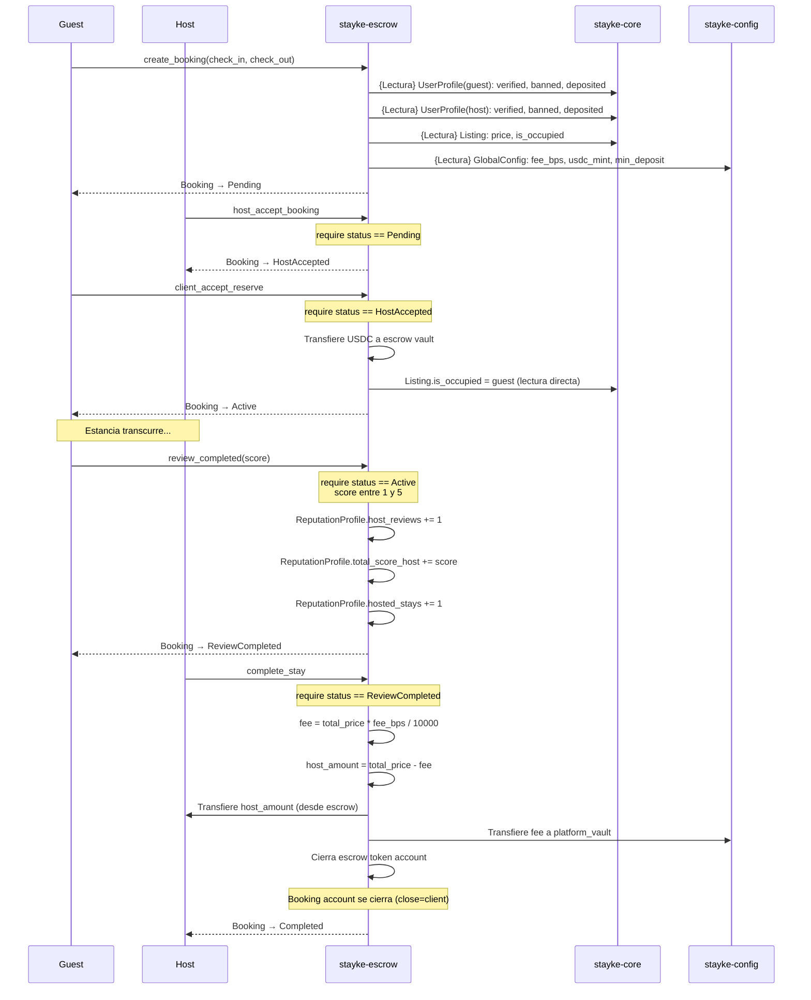
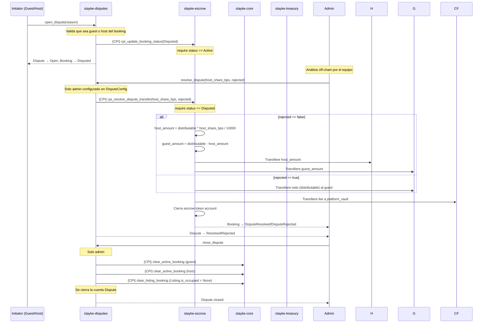
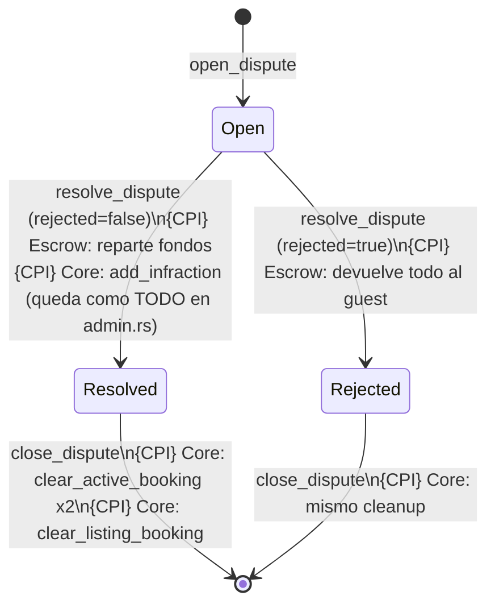
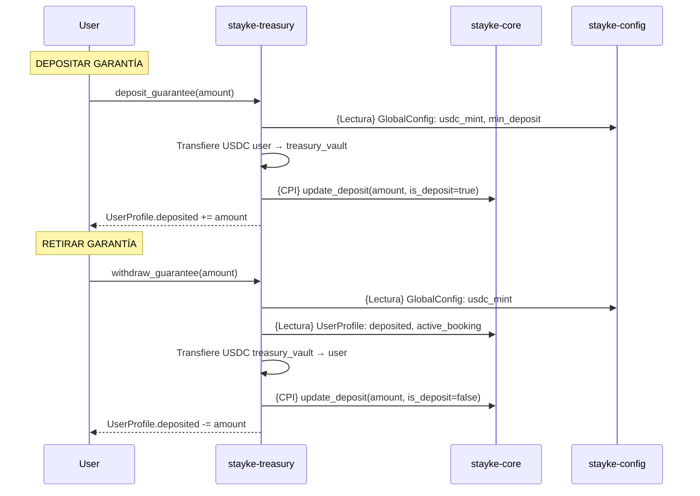
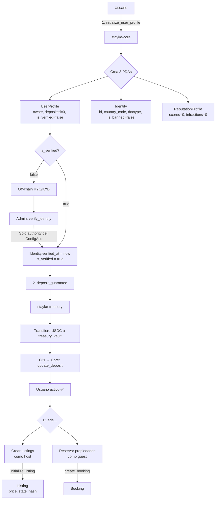
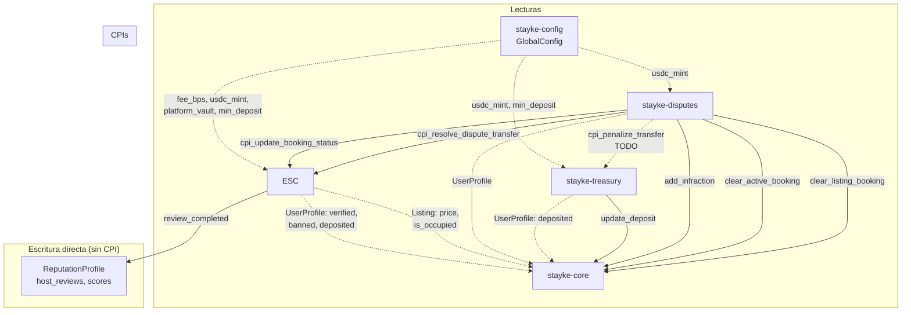

# 📊 Diagramas de Flujo — Stayke Contracts

> Diagramas del estado actual de los 5 contratos Anchor, sus relaciones CPI y ciclos de vida.
> Generado con Mermaid.js — renderizable en GitHub, VS Code y cualquier visor Markdown.

---

## 📋 Convenciones

| Símbolo | Significado |
|---------|-------------|
| `[Usuario]` | Acción del usuario (firma con su wallet) |
| `[Admin]` | Acción restringida a authority/admin |
| `{CPI}` | Cross-Program Invocation |
| `{Lectura}` | Lectura de estado sin mutar |
| `##` | Estado intermedio de cuenta |
| `==X==>` | Transición con condición sobre el estado actual |
| `- - ->` | Flujo secundario / off-chain |
| `close ✗` | La cuenta Booking se cierra (renta devuelta) |

---

## 1. 🌍 Vista General del Ecosistema

```mermaid
flowchart LR
    subgraph "⚙️ stayke-config"
        GC[GlobalConfig<br/>authority · fee_bps · min_deposit<br/>usdc_mint · platform_vault]
    end

    subgraph "🧠 stayke-core"
        CP[ConfigAcc]
        UP[UserProfile]
        RP[ReputationProfile]
        ID[Identity]
        LI[Listing]
    end

    subgraph "🏦 stayke-escrow"
        EC[EscrowConfig]
        BK[Booking]
        BD[BookingDays]
    end

    subgraph "⚖️ stayke-disputes"
        DC[DisputeConfig]
        DS[Dispute]
    end

    subgraph "💰 stayke-treasury"
        TC[TreasuryConfig]
        TV[(Treasury Vault)]
    end

    GC -.->|Lectura: fee_bps, usdc_mint| BK
    GC -.->|Lectura: usdc_mint, min_deposit| TV
    GC -.->|Lectura: usdc_mint| DS

    UP -.->|Lectura: is_verified, banned, deposited| BK
    LI -.->|Lectura: price, is_occupied| BK

    DS -->|{CPI} cpi_update_booking_status| BK
    DS -->|{CPI} cpi_resolve_dispute_transfer| BK
    DS -->|{CPI} add_infraction| RP
    DS -->|{CPI} clear_active_booking| UP
    DS -->|{CPI} clear_listing_booking| LI
    DS --x|{CPI} cpi_penalize_transfer (TODO)| TV

    TV -->|{CPI} update_deposit| UP
```

---

## 2. 🔄 Ciclo de Vida de una Reserva (Booking)

> Basado en el código real en `programs/stayke-escrow/src/instructions/booking.rs` y `dispute_cpi.rs`.

```mermaid
stateDiagram-v2
    [*] --> Pending: create_booking (guest)
    
    Pending --> HostAccepted: host_accept_booking (host)
    Pending --> Cancelled: host_reject_booking (host)  close✗
    Pending --> Cancelled: client_reject_reserve (guest)  close✗
    
    HostAccepted --> Active: client_accept_reserve (guest)\nTransfiere USDC a escrow vault\nListing.is_occupied = guest
    HostAccepted --> Cancelled: client_reject_reserve (guest)  close✗
    
    Active --> ReviewCompleted: review_completed (guest)\nScore 1-5 · Actualiza ReputationProfile
    
    Active --> Disputed: open_dispute (guest/host)\n{CPI} → Escrow: cpi_update_booking_status(Disputed)
    
    ReviewCompleted --> Completed: complete_stay\nDistribuye USDC al host + fee platform\nCierra escrow token account  close✗
    
    Disputed --> DisputeResolved: resolve_dispute\n{CPI} → Escrow: cpi_resolve_dispute_transfer\nReparte fondos, cierra escrow
    Disputed --> DisputeRejected: resolve_dispute (rejected=true)\n{CPI} → Escrow: cpi_resolve_dispute_transfer\nFondos devueltos al guest

    note right of DisputeResolved
        close_dispute (admin) →
        {CPI} clear_active_booking (guest)
        {CPI} clear_active_booking (host)
        {CPI} clear_listing_booking
        Cierra la cuenta Dispute
    end

    note right of DisputeRejected
        close_dispute (admin) →
        mismo cleanup que Resolved
    end
    
    Completed --> [*]
    Cancelled --> [*]
    DisputeResolved --> [*]
    DisputeRejected --> [*]
```

### Diagrama de Secuencia — Reserva Feliz (sin disputa)



---

## 3. ⚖️ Flujo de Disputa (Máxima Interconexión)



### Máquina de Estados de Disputa



---

## 4. 💰 Flujo de Garantías (Treasury)



---

## 5. 🆔 Flujo de Onboarding de Usuario



---

## 6. 🗺️ Mapa de Relaciones Entre Programas



---

## Leyenda de Estados Booking

| Estado | Descripción | Transiciones válidas desde código |
|--------|-------------|-----------------------------------|
| `Pending` | Creada por guest, esperando respuesta del host | → HostAccepted, Cancelled |
| `HostAccepted` | Host aceptó, esperando que guest confirme | → Active, Cancelled |
| `Active` | Guest confirmó, fondos en escrow, estancia activa | → ReviewCompleted, Disputed |
| `ReviewCompleted` | Guest calificó (1-5), esperando complete_stay | → Completed |
| `Completed` | Finalizada, fondos distribuidos, booking cerrado | Terminal |
| `Cancelled` | Cancelada, booking cerrado (close) | Terminal |
| `Disputed` | Disputa abierta, booking congelado | → DisputeResolved, DisputeRejected |
| `DisputeResolved` | Disputa resultta, fondos repartidos | Terminal (close_dispute solo cleanup en Core) |
| `DisputeRejected` | Disputa rechazada, fondos devueltos | Terminal (close_dispute solo cleanup en Core) |

### Restricciones por instrucción

| Instrucción | Estado Requerido | Handler |
|-------------|------------------|---------|
| `host_accept_booking` | `Pending` | `handler_host_accept_booking` |
| `host_reject_booking` | `Pending` (close booking) | `handler_host_reject_booking` |
| `client_accept_reserve` | `HostAccepted` | `handler_client_accept_reserve` |
| `client_reject_reserve` | `HostAccepted` o `Pending` (close booking) | `handler_client_reject_reserve` |
| `review_completed` | `Active` | `handler_review_completed` |
| `complete_stay` | `ReviewCompleted` | `handler_complete_stay` |
| `open_dispute` | `Active` (via CPI a Escrow) | `handler_open_dispute` |
| `resolve_dispute` | `Disputed` (via CPI a Escrow) | `handler_resolve_dispute` |

---

> **Nota**: Este diagrama refleja el código actual en la rama `STK-97-re-organizar-instrucciones-en-stayke-treasury`.
> Basado en `booking.rs` (823 líneas), `dispute_cpi.rs` (240 líneas) y `manage_disputes.rs` (288 líneas).
> Los TODOs conocidos (cpi_penalize_transfer, withdraw fees, validaciones faltantes) están marcados con `TODO`.
