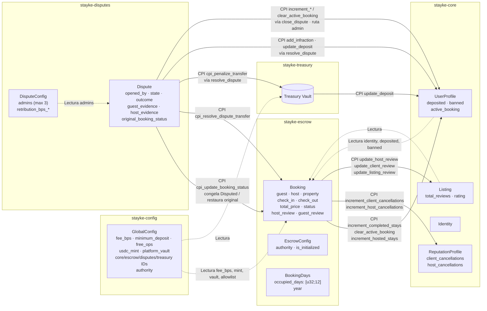
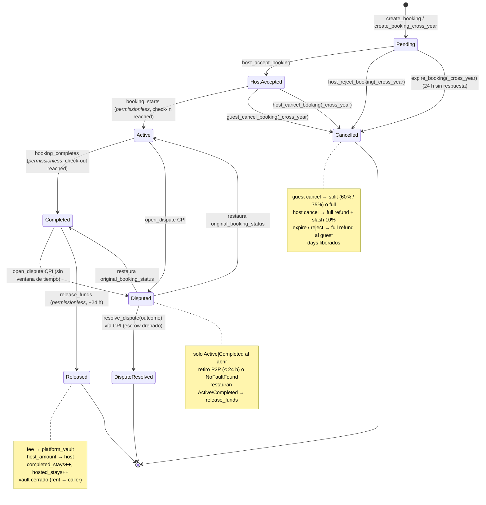
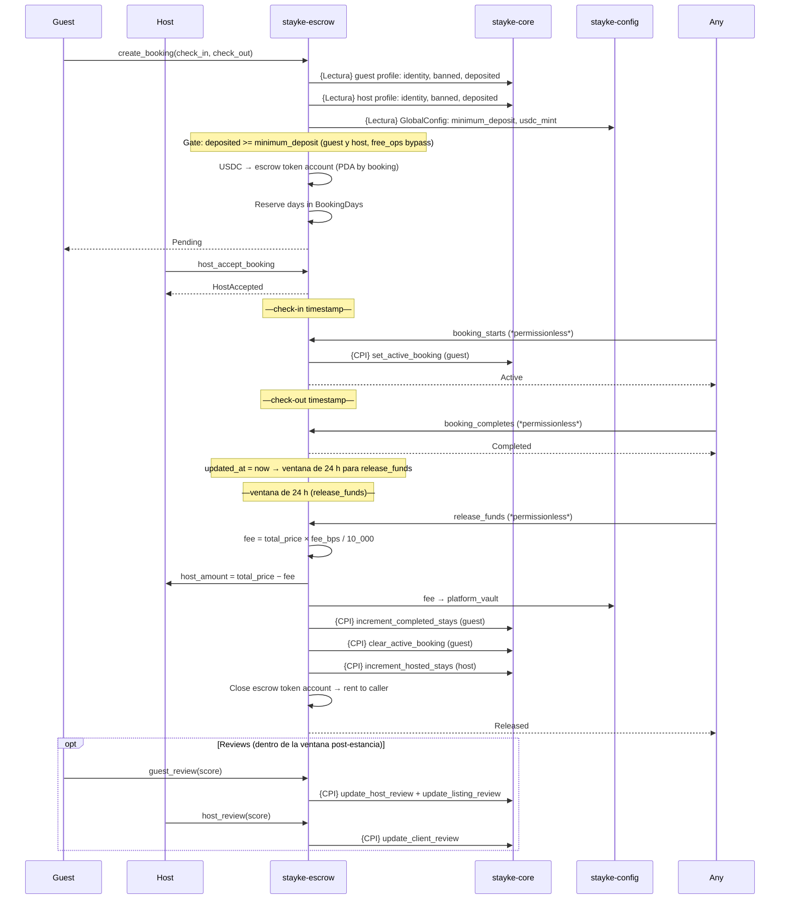
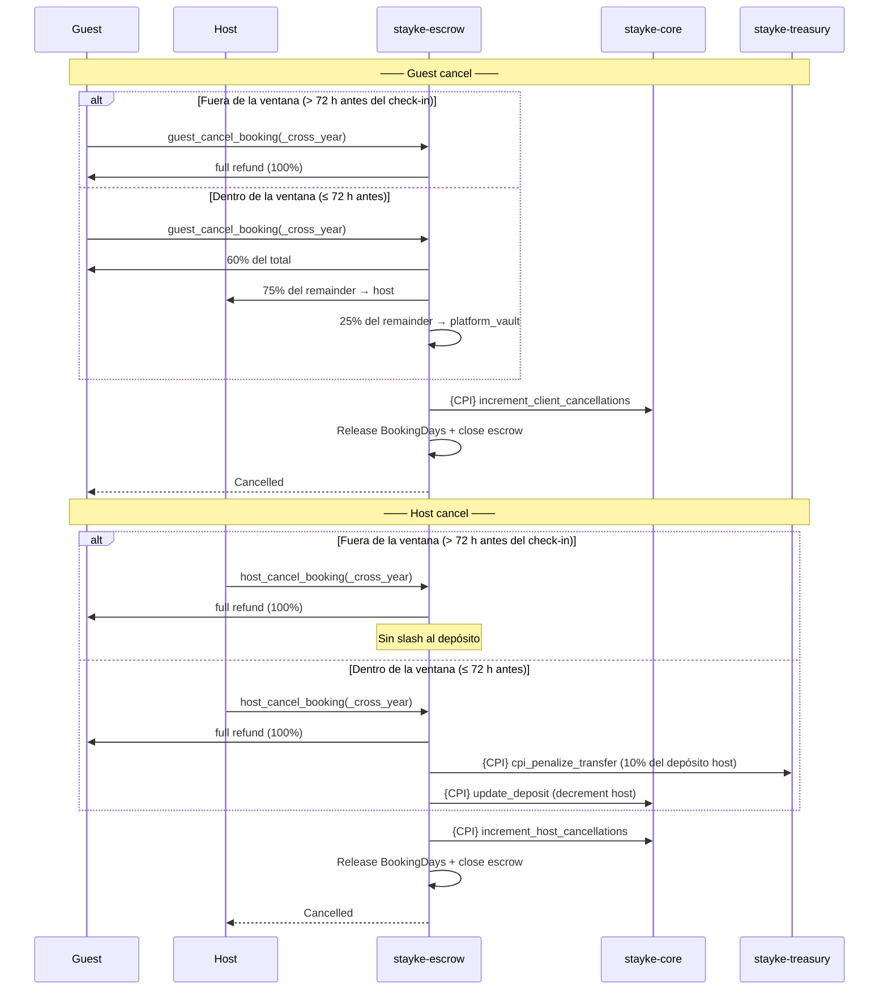
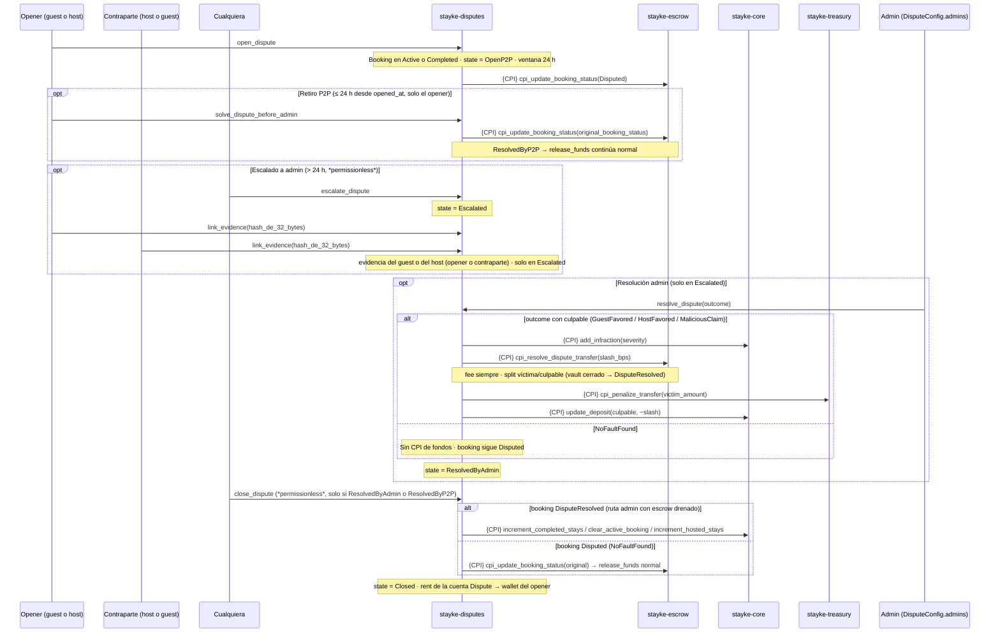
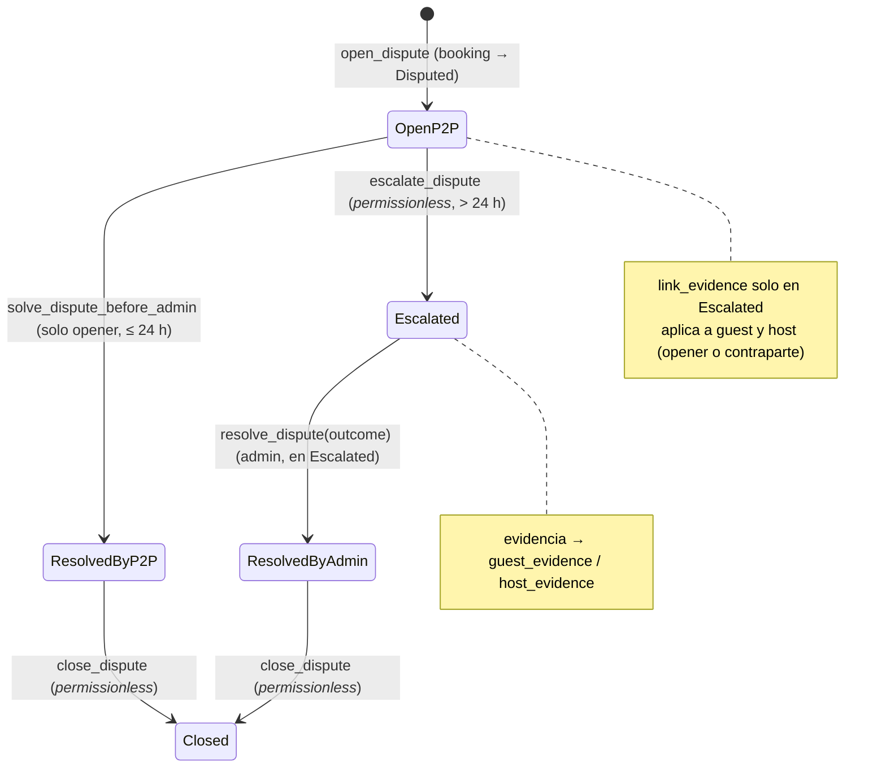
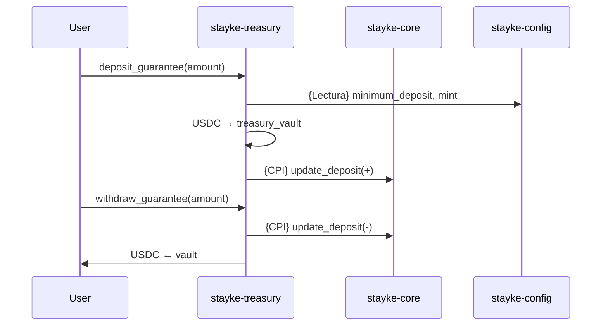
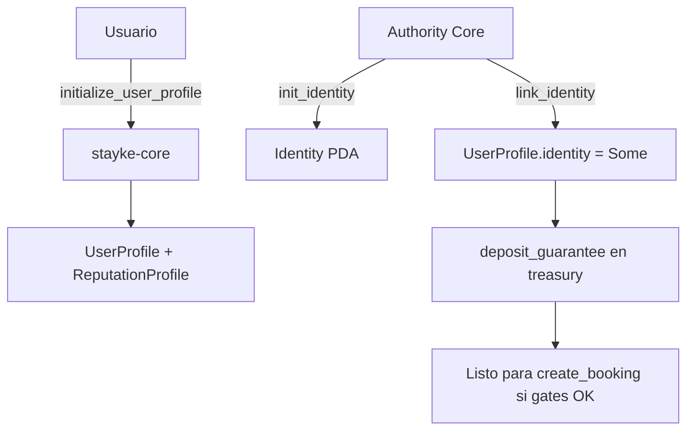

# Diagramas de flujo — Stayke Contracts (as implemented)

> **As implemented** — documenta el código on-chain actual (`programs/**`), no la política de producto.
> **SoT (norma):** [stayke-docs](https://github.com/GestLabs2-0/docs/blob/main/README.md). Si hay conflicto, manda la SoT; aquí solo se describen gaps explícitos.

Mermaid alineado a `lib.rs` / CPI actuales. Referencia de cuentas: [stayke-global.guide.md](./stayke-global.guide.md). Detalle de instrucciones: [disputes](./stayke-disputes.guide.md) y [escrow](./stayke-escrow.guide.md).

## Camino rápido

1. Vista ecosistema → diagrama 1.
2. Booking feliz → diagrama 2 / secuencia.
3. Cancelaciones → diagrama 3.
4. Disputa P2P-first (ventana 24 h → escalado → `resolve_dispute(outcome)`) → diagrama 4.
5. Onboarding: `init_identity` / `link_identity` → diagrama 6.

## Detalles

### Convenciones

| Símbolo | Significado |
|---------|-------------|
| `CPI` | Cross-Program Invocation (en labels de flowchart se omite `{}` por compatibilidad del parser) |
| `Lectura` | Lectura de estado sin mutar |
| Admin | Authority / admin de DisputeConfig |
| *permissionless* | Cualquier usuario puede llamar; el programa valida las condiciones |

### 1. Vista general del ecosistema

- `escalate_dispute` y `link_evidence` solo mutan la cuenta `Dispute`; `solve_dispute_before_admin` / `close_dispute` además mutan booking/Core vía CPI (`escalate` y `close` son permissionless).
- `clear_listing_booking` sigue existiendo en core pero **ya no tiene callers** (CPI sin uso).

### 2. Ciclo de vida Booking

`DisputeRejected` queda en el enum de `BookingStatus` pero **ninguna ruta lo produce hoy**: la resolución siempre termina en `DisputeResolved`.

### Secuencia — reserva feliz

### 3. Cancelaciones

### 4. Disputa — P2P-first

Secuencia (detalle de validaciones en [disputes](./stayke-disputes.guide.md)):

Máquina de estados de la cuenta `Dispute`:

- `penalize_user` ya **no existe**: la penalización (treasury + reputación + depósito) vive dentro de `resolve_dispute(outcome)`.
- `resolve_dispute` exige `dispute.state == Escalated` (`DisputeNotEscalated`) y admin en `config.admins` (`UnauthorizedAdmin`).
- `solve_dispute_before_admin` exige ser el opener (`UnauthorizedDisputeSolver`) y estar dentro de la ventana (`P2PWindowElapsed` en caso contrario).
- `link_evidence` acepta al **guest o al host del booking** (opener o contraparte), solo en `Escalated`; cualquier otro firmante → `UnauthorizedUser`. `EvidenceLinked` sigue definido pero sin enforce (la evidencia se sobrescribe).

### 5. Garantías (Treasury)

### 6. Onboarding identity (Core real)

No hay `verify_identity` ni `set_host_status` en el programa actual.

## Cancellation policy — MVP constants

| Constant | Value | Descripción |
| --- | --- | --- |
| `CANCELLATION_WINDOW_HOURS` | `72` | Horas antes del check-in dentro de las cuales aplica el split |
| `CANCELLATION_REFUND_PERCENTAGE` | `60` | % del total que recibe el guest dentro de la ventana |
| `CANCELLATION_HOST_SHARE_PERCENTAGE` | `75` | % del remainder post-refund que recibe el host dentro de la ventana |
| `HOST_CANCELLATION_PENALTY_PERCENTAGE` | `10` | % del depósito del host que se quita en cancelación tardía |

> Los montos se calculan como remainder para que guest + host + Stayke sumen exactamente `total_price` sin pérdida por redondeo.

## Policy SoT vs On-chain gate

El gate `deposited >= minimum_deposit` en `create_booking` (y related) diverge de L1/L4 SoT. Callout completo: [escrow](./stayke-escrow.guide.md).

## Gaps

- `GlobalConfig` ya persiste los 4 program IDs (`core/escrow/disputes/treasury`) — allowlist `AllowedCaller` en `assert_cpi_authority`; ya no es un gap.
- `clear_listing_booking` (core) queda sin callers (CPI no usado por escrow/disputes).
- Disputas: sin ventana de apertura (un `Completed` puede disputarse sin límite) y admin único sin quórum (solo el authority del init, sin add/remove). ~~Evidencia solo del opener~~ → **resuelto**: `link_evidence` acepta a guest u host (opener o contraparte); `EvidenceLinked` sigue sin enforce (sobrescribe) → [disputes](./stayke-disputes.guide.md).
- Vault del escrow sin cerrar en `expire_booking` (ambas variantes) y `host_reject_booking_cross_year` (rent bloqueada) → [escrow](./stayke-escrow.guide.md).
- Yield no diagramado como live → [ADR-010](https://github.com/GestLabs2-0/docs/blob/main/architecture/adrs/ADR-010-yield-deferred-stage-2.md).

## Checklist

- [x] Diagramas muestran `booking_starts` / `booking_completes` como permissionless
- [x] Diagrama de cancelaciones con split policy y host slash
- [x] `release_funds` como settlement permissionless post-24 h
- [x] Reviews separados: `guest_review` + `host_review` (no solo `review_completed`)
- [x] Diagrama 4 refleja el flujo P2P-first (ventana 24 h, escalado, close permissionless) y que `penalize_user` ya no existe
- [x] `resolve_dispute` integra escrow + treasury + reputación (la resolución admin ya no es "solo escrow")
- [x] Onboarding usa `init_identity` / `link_identity`
- [x] Cross-year variants documentados en las transiciones
- [ ] Sin footer de rama/archivos stale