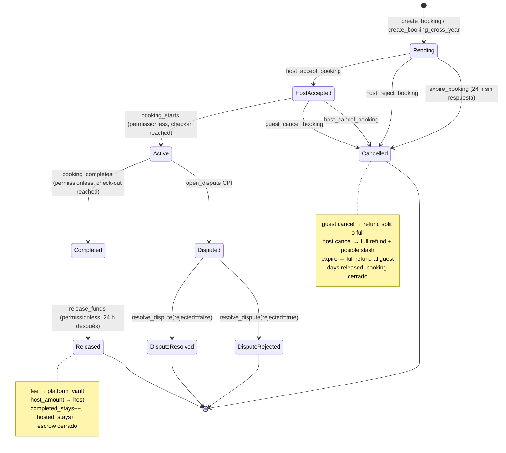
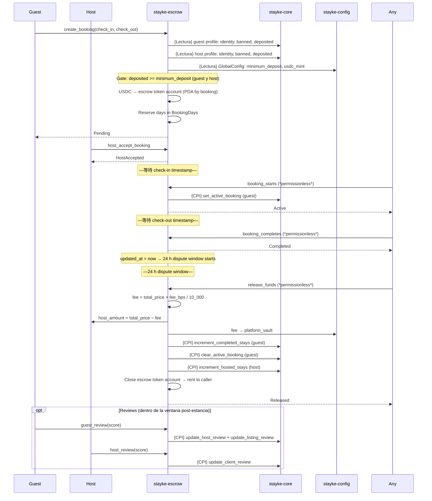
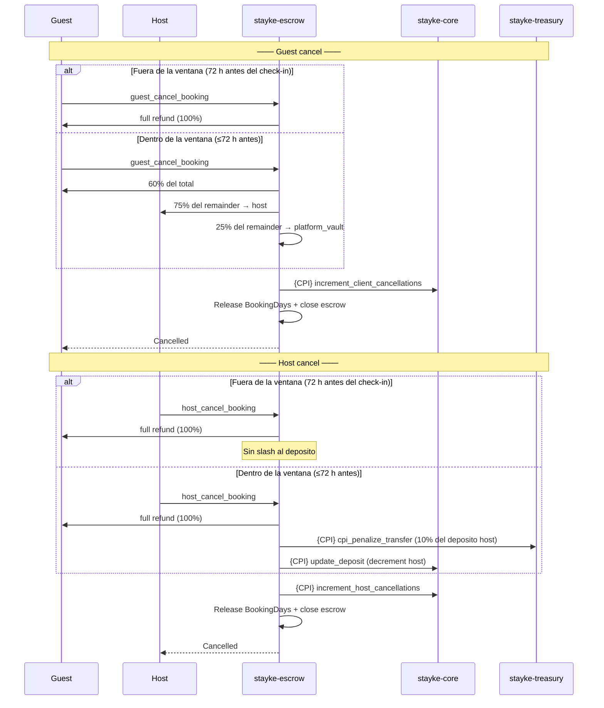
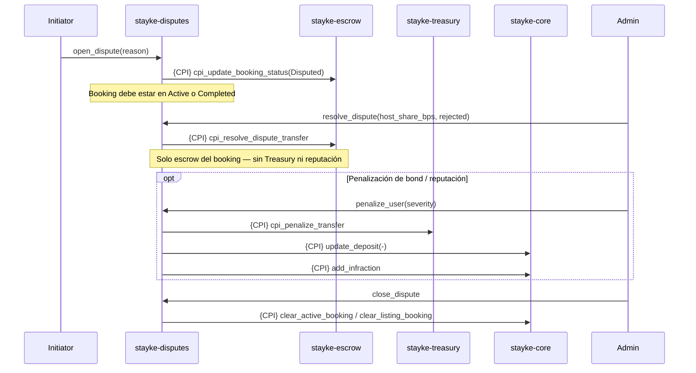
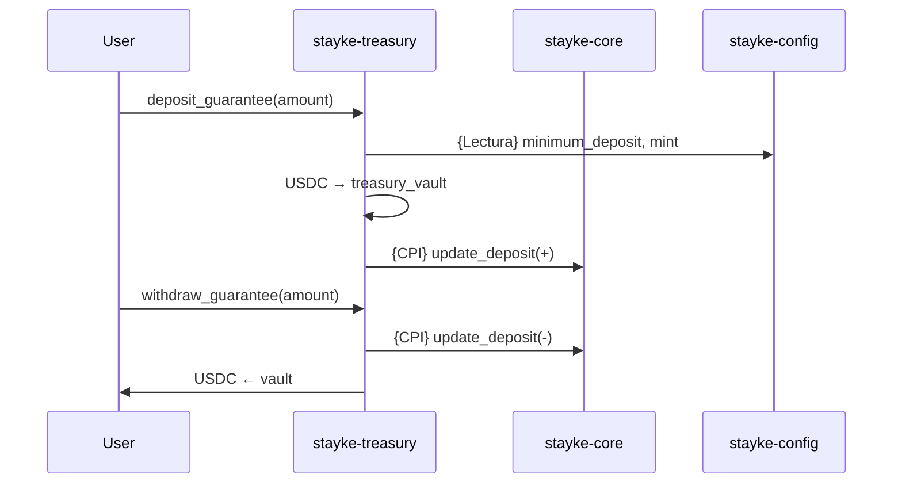
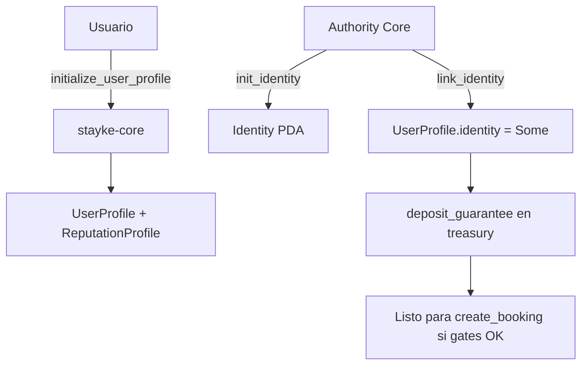

# Diagramas de flujo — Stayke Contracts (as implemented)

> **As implemented** — documenta el código on-chain actual (`programs/**`), no la política de producto.
> **SoT (norma):** [stayke-docs](https://github.com/GestLabs2-0/docs/blob/main/README.md). Si hay conflicto, manda la SoT; aquí solo se describen gaps explícitos.

Mermaid alineado a `lib.rs` / CPI actuales. Referencia de cuentas: [stayke-global.guide.md](./stayke-global.guide.md).

## Camino rápido

1. Vista ecosistema → diagrama 1.
2. Booking feliz → diagrama 2 / secuencia.
3. Cancelaciones → diagrama 3.
4. Disputa: `resolve` ≠ `penalize` → diagrama 4.
5. Onboarding: `init_identity` / `link_identity` → diagrama 6.

## Detalles

### Convenciones

| Símbolo | Significado |
|---------|-------------|
| `{CPI}` | Cross-Program Invocation |
| `{Lectura}` | Lectura de estado sin mutar |
| Admin | Authority / admin de DisputeConfig |
| *permissionless* | Cualquier usuario puede llamar; el programa valida las condiciones |

### 1. Vista general del ecosistema

```mermaid
flowchart LR
    subgraph "stayke-config"
        GC[GlobalConfig<br/>fee_bps · minimum_deposit<br/>usdc_mint · platform_vault<br/>authority]
    end

    subgraph "stayke-core"
        UP[UserProfile<br/>deposited · banned<br/>active_booking]
        RP[ReputationProfile<br/>client_cancellations<br/>host_cancellations]
        ID[Identity]
        LI[Listing<br/>total_reviews · rating]
    end

    subgraph "stayke-escrow"
        BK[Booking<br/>guest · host · property<br/>check_in · check_out<br/>total_price · status<br/>host_review · guest_review]
        EC[EscrowConfig<br/>authority · is_initialized]
        BD[BookingDays<br/>occupied_days: [u32;12]<br/>year]
    end

    subgraph "stayke-disputes"
        DS[Dispute]
    end

    subgraph "stayke-treasury"
        TV[(Treasury Vault)]
    end

    GC -.->|{Lectura} fee_bps, mint, vault| BK
    GC -.->|{Lectura}| TV
    UP -.->|{Lectura} identity, deposited, banned| BK
    LI -.->|{Lectura}| BK

    BK -->|{CPI} increment_completed_stays<br/>clear_active_booking<br/>increment_hosted_stays| UP
    BK -->|{CPI} increment_client_cancellations<br/>increment_host_cancellations| RP
    BK -->|{CPI} update_host_review<br/>update_client_review<br/>update_listing_review| LI

    DS -->|{CPI} cpi_update_booking_status| BK
    DS -->|{CPI} cpi_resolve_dispute_transfer| BK
    DS -->|{CPI} cpi_penalize_transfer<br/>vía penalize_user| TV
    DS -->|{CPI} add_infraction · update_deposit<br/>vía penalize_user| UP
    DS -->|{CPI} clear_* vía close_dispute| UP
    DS -->|{CPI} clear_listing_booking| LI

    TV -->|{CPI} update_deposit| UP
```

### 2. Ciclo de vida Booking



### Secuencia — reserva feliz



### 3. Cancelaciones



### 4. Disputa — resolve ≠ penalize



### 5. Garantías (Treasury)



### 6. Onboarding identity (Core real)



No hay `verify_identity` ni `set_host_status` en el programa actual.

## Cancellation policy — MVP constants

| Constant | Value | Descripción |
| --- | --- | --- |
| `CANCELLATION_WINDOW_HOURS` | `72` | Horas antes del check-in dentro de las cuales aplica el split |
| `CANCELLATION_REFUND_PERCENTAGE` | `60` | % del total que recibe el guest dentro de la ventana |
| `CANCELLATION_HOST_SHARE_PERCENTAGE` | `75` | % del remainder post-refund que recibe el host dentro de la ventana |
| `HOST_CANCELLATION_PENALTY_PERCENTAGE` | `10` | % del deposito del host que se quita en cancelación tardía |

> Los montos se calculan como remainder para que guest + host + Stayke sumen exactamente `total_price` sin pérdida por redondeo.

## Policy SoT vs On-chain gate

El gate `deposited >= minimum_deposit` en `create_booking` (y related) diverge de L1/L4 SoT. Callout completo: [escrow](./stayke-escrow.guide.md).

## Gaps

- `GlobalConfig` sin program IDs (diagrama 1).
- Yield no diagramado como live → [ADR-010](https://github.com/GestLabs2-0/docs/blob/main/architecture/adrs/ADR-010-yield-deferred-stage-2.md).
- Validaciones token / PDA signer en disputes → [security](./stayke-todos-security.guide.md).

## Checklist

- [x] Diagramas muestran `booking_starts` / `booking_completes` como permissionless
- [x] Diagrama de cancelaciones con split policy y host slash
- [x] `release_funds` como settlement permissionless post-24 h
- [x] Reviews separados: `guest_review` + `host_review` (no solo `review_completed`)
- [x] `resolve_dispute` no implica treasury
- [x] Onboarding usa `init_identity` / `link_identity`
- [x] Cross-year variants documentados en las transiciones
- [ ] Sin footer de rama/archivos stale
