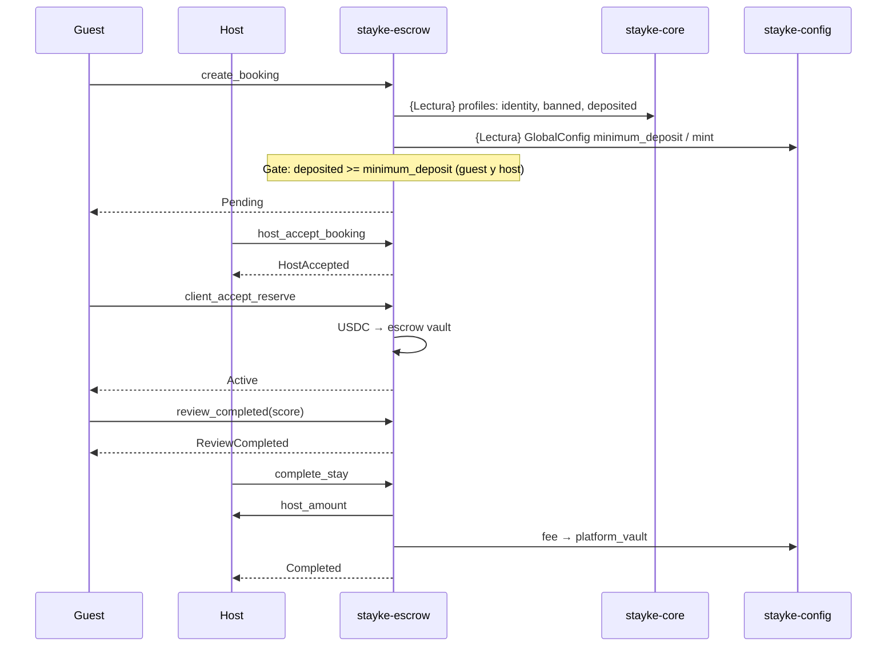
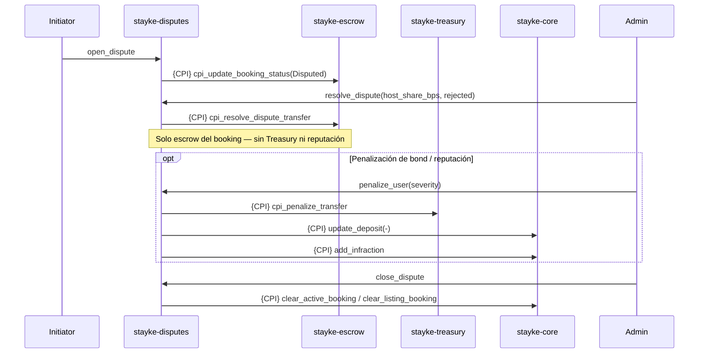
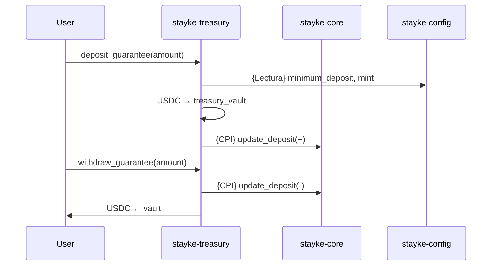
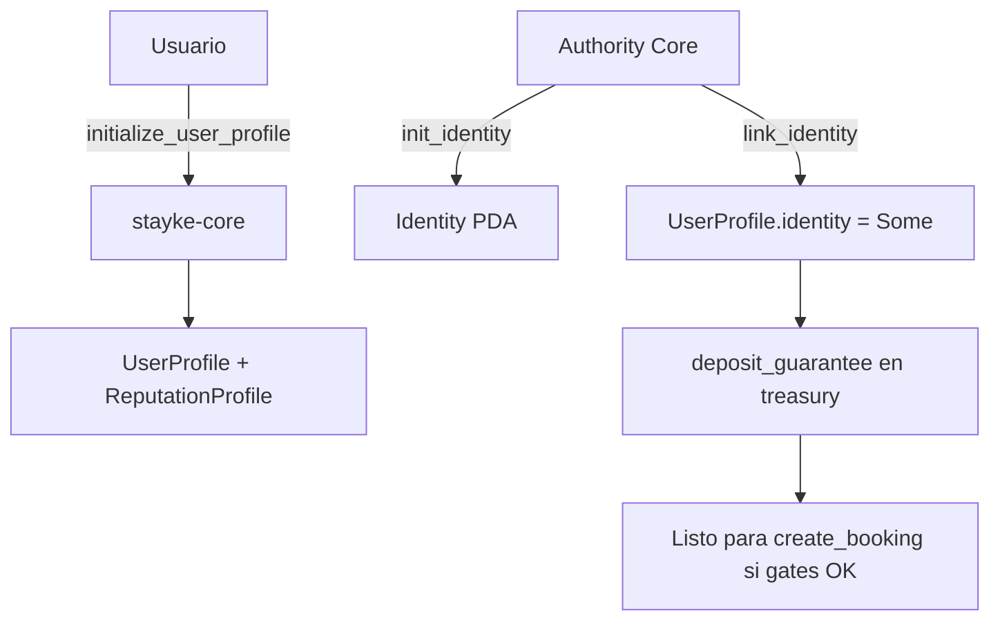

# Diagramas de flujo — Stayke Contracts (as implemented)

> **As implemented** — documenta el código on-chain actual (`programs/**`), no la política de producto.
> **SoT (norma):** [stayke-docs](https://github.com/GestLabs2-0/docs/blob/main/README.md). Si hay conflicto, manda la SoT; aquí solo se describen gaps explícitos.

Mermaid alineado a `lib.rs` / CPI actuales. Referencia de cuentas: [stayke-global.guide.md](./stayke-global.guide.md).

## Camino rápido

1. Vista ecosistema → diagrama 1.
2. Booking feliz → diagrama 2 / secuencia.
3. Disputa: `resolve` ≠ `penalize` → diagrama 3.
4. Onboarding: `init_identity` / `link_identity` → diagrama 5.

## Detalles

### Convenciones

| Símbolo | Significado |
|---------|-------------|
| `{CPI}` | Cross-Program Invocation |
| `{Lectura}` | Lectura de estado sin mutar |
| Admin | Authority / admin de DisputeConfig |

### 1. Vista general del ecosistema

```mermaid
flowchart LR
    subgraph "stayke-config"
        GC[GlobalConfig<br/>fee_bps · min_deposit<br/>usdc_mint · platform_vault<br/>sin program IDs]
    end

    subgraph "stayke-core"
        UP[UserProfile]
        RP[ReputationProfile]
        ID[Identity]
        LI[Listing]
    end

    subgraph "stayke-escrow"
        BK[Booking]
    end

    subgraph "stayke-disputes"
        DS[Dispute]
    end

    subgraph "stayke-treasury"
        TV[(Treasury Vault)]
    end

    GC -.->|{Lectura}| BK
    GC -.->|{Lectura}| TV
    UP -.->|{Lectura} identity · deposited · banned| BK
    LI -.->|{Lectura}| BK

    DS -->|{CPI} cpi_update_booking_status| BK
    DS -->|{CPI} cpi_resolve_dispute_transfer| BK
    DS -->|{CPI} cpi_penalize_transfer<br/>vía penalize_user| TV
    DS -->|{CPI} add_infraction · update_deposit<br/>vía penalize_user| UP
    DS -->|{CPI} clear_* vía close_dispute| UP
    DS -->|{CPI} clear_listing_booking| LI

    TV -->|{CPI} update_deposit| UP
```

### 2. Ciclo de vida Booking

```mermaid
stateDiagram-v2
    [*] --> Pending: create_booking
    Pending --> HostAccepted: host_accept_booking
    Pending --> Cancelled: host_reject / client_reject
    HostAccepted --> Active: client_accept_reserve
    HostAccepted --> Cancelled: client_reject_reserve
    Active --> ReviewCompleted: review_completed
    Active --> Disputed: open_dispute CPI
    ReviewCompleted --> Completed: complete_stay
    Disputed --> DisputeResolved: resolve_dispute rejected=false
    Disputed --> DisputeRejected: resolve_dispute rejected=true
    note right of DisputeResolved
      close_dispute → clear Core
      penalize_user es instrucción aparte
    end
    Completed --> [*]
    Cancelled --> [*]
    DisputeResolved --> [*]
    DisputeRejected --> [*]
```

### Secuencia — reserva feliz



### 3. Disputa — resolve ≠ penalize



### 4. Garantías (Treasury)



### 5. Onboarding identity (Core real)



No hay `verify_identity` ni `set_host_status` en el programa actual.

### Policy SoT vs On-chain gate

El gate `deposited >= minimum_deposit` en `create_booking` (y related) diverge de L1/L4 SoT. Callout completo: [escrow](./stayke-escrow.guide.md).

## Gaps

- `GlobalConfig` sin program IDs (diagrama 1).
- Yield no diagramado como live → [ADR-010](https://github.com/GestLabs2-0/docs/blob/main/architecture/adrs/ADR-010-yield-deferred-stage-2.md).
- Validaciones token / PDA signer en disputes → [security](./stayke-todos-security.guide.md).

## Checklist

- [ ] Diagramas muestran `penalize_user` → `cpi_penalize_transfer` (implementado)
- [ ] `resolve_dispute` no implica treasury
- [ ] Onboarding usa `init_identity` / `link_identity`
- [ ] Sin footer de rama/archivos stale
